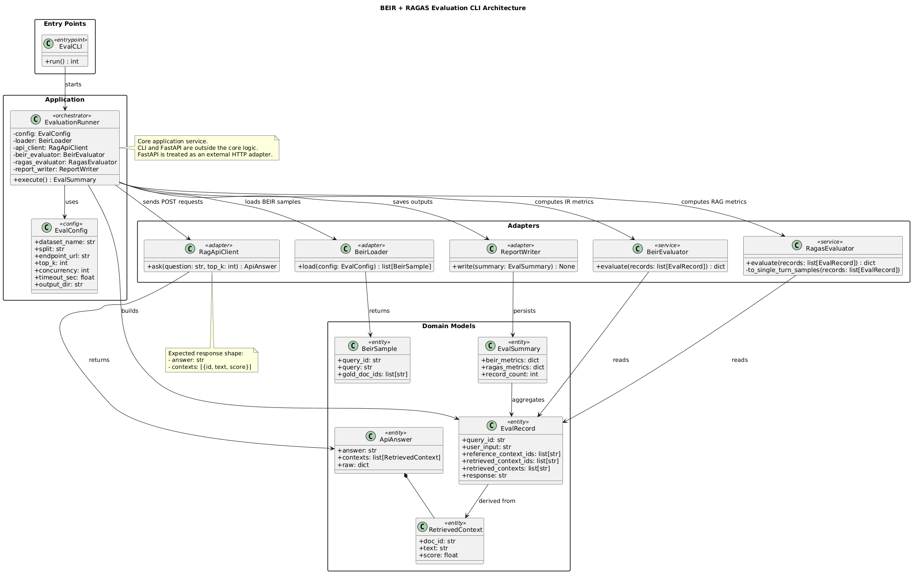

# Edge RAG Evaluator

BEIR 기반 평가와 RAGAS 점수를 계산하는 CLI 모듈입니다.

CLI module that evaluates BEIR retrieval and computes RAGAS metrics.

---
## 개요 / Overview
- 외부 서버에 질문을 POST로 전송합니다.
- 응답을 기반으로 BEIR / RAGAS 평가를 실행합니다.
- 결과를 JSON/Markdown으로 저장할 수 있습니다.

- Sends questions to an external server via POST.
- Runs BEIR / RAGAS evaluation from the responses.
- Persists results as JSON/Markdown.

---
## 설치 / Installation
```bash
uv sync
```

---
## 사용법 / Usage
```bash
uv run main.py \
  --dataset scifact \
  --base-url http://localhost:8000 \
  --top-k 5 \
  --ragas-metric Faithfulness \
  --ragas-metric ResponseRelevancy
```
---
## 아키텍처 / Architecture
UML 다이어그램: `UML/evaluation_architecture.puml`

---
### 다이어그램 이미지 / Diagram Image


---
## 요청/응답 스키마 / Request/Response Schema

이 모듈은 외부 서버로 단일 POST 요청을 보냅니다.
The module sends a single POST request to an external server.

서버는 아래 형식의 요청 본문을 받고, 동일한 스키마로 응답해야 합니다.
The server should accept the request body and return a response in the format below.

### Request (JSON)
```json
{
  "question": "string",
  "top_k": 5
}
```

### Response (JSON)
```json
{
  "answer": "string",
  "contexts": [
    {
      "id": "doc_id",
      "text": "context chunk",
      "score": 0.91
    }
  ]
}
```
